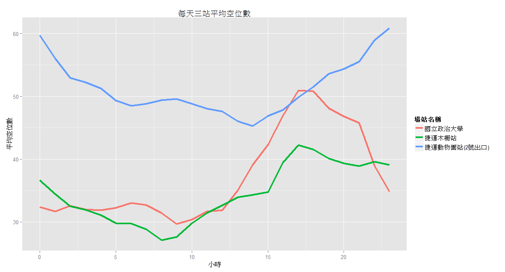
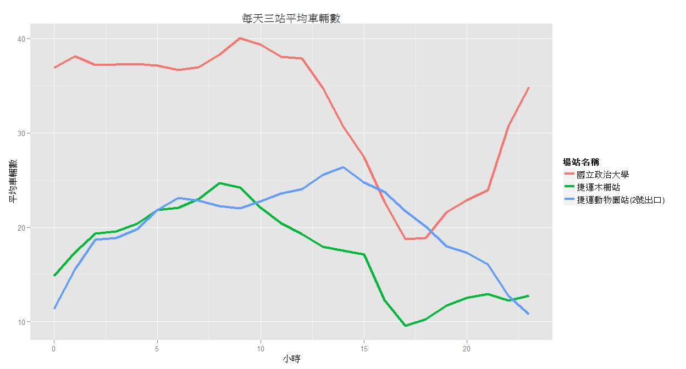
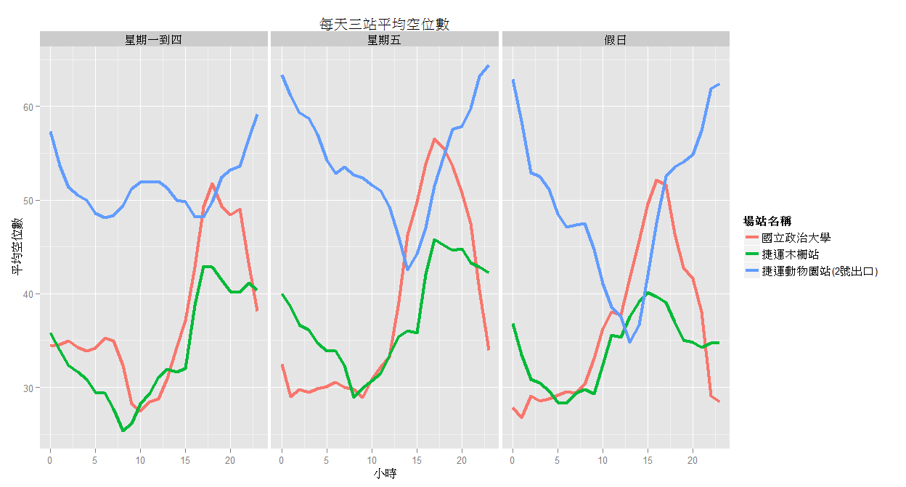
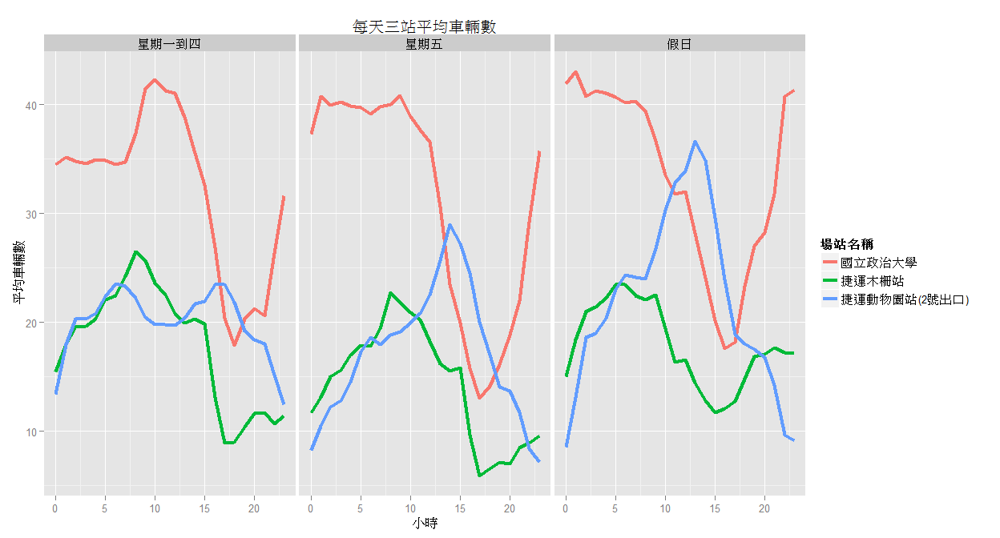
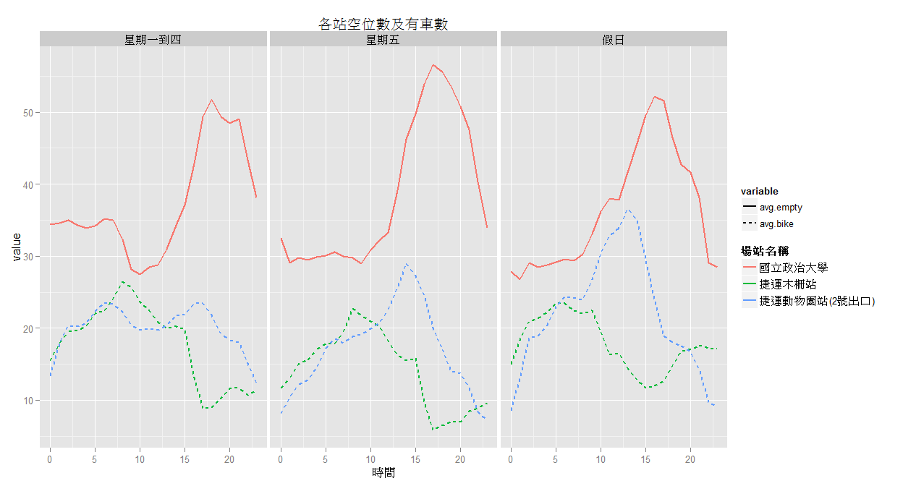
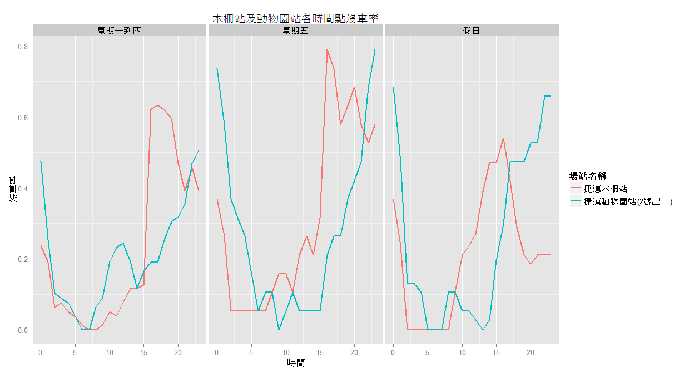
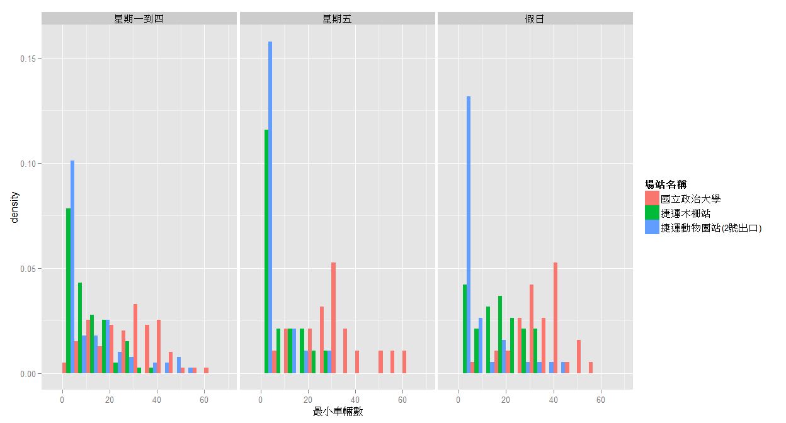
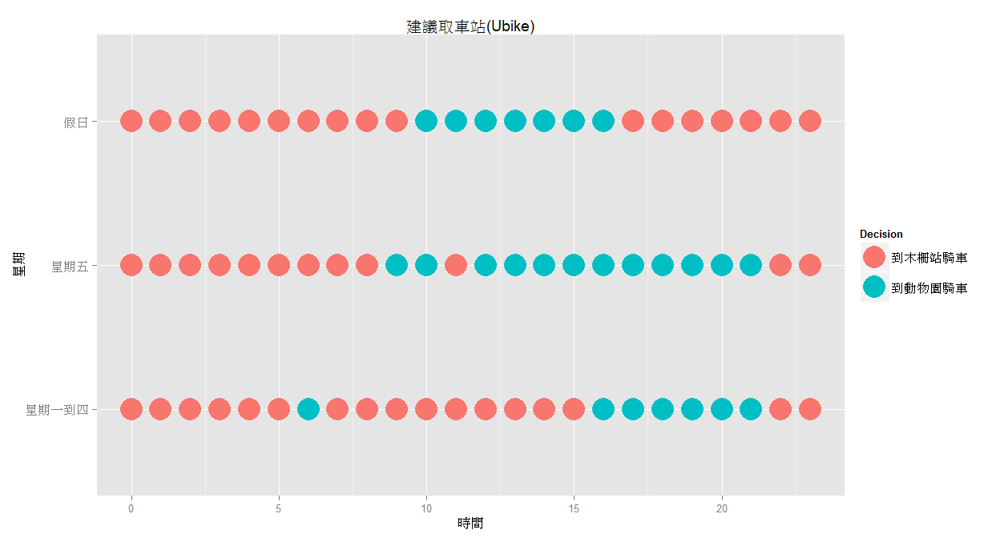

# DSP
DSP Summer camp Team2  
2015年7月2日  


```r
library(data.table)
library(ggplot2)
library(dplyr)
library(reshape2)
library(car)
```


```r
ubike <- fread("C:/Users/jason/Desktop/ubikebyhourbig5/UbikeFinal.csv",
               data.table=FALSE)
```

```

Read 11.5% of 867605 rows
Read 25.4% of 867605 rows
Read 39.2% of 867605 rows
Read 53.0% of 867605 rows
Read 66.9% of 867605 rows
Read 76.1% of 867605 rows
Read 88.8% of 867605 rows
Read 867605 rows and 21 (of 21) columns from 0.118 GB file in 00:00:10
```


```r
ubike <- tbl_df(ubike)
ubike <- ubike %>%
  mutate(Date=as.POSIXct(日期)) %>% 
  mutate(Month=month(Date)) %>%
  mutate(Quarter=quarter(Date)) %>%
  mutate(weekend=as.factor((as.numeric(strftime(Date, "%u")))))
#adjust
ubike$weekend <- recode(ubike$weekend, "1:4='星期一到四'; 5='星期五'; 6:7='假日'")
```


```r
final_data <- ubike %>%
        filter(場站名稱 == "國立政治大學" | 場站名稱 == "捷運動物園站(2號出口)" | 場站名稱 == "捷運木柵站")
```


```r
t1 <- final_data %>%
        group_by(場站名稱, 時間) %>%
        summarise(avg.empty=mean(平均空位數))

t_bike1 <- final_data %>%
            group_by(場站名稱, 時間) %>%
            summarise(avg.empty=mean(平均車輛數))

#Processed
t11 <- melt(t1, id=c("場站名稱", "時間"))
t_bike11 <- melt(t_bike1, id=c("場站名稱", "時間"))
```


```r
#兩站平均空位數
g1 <- ggplot(t11) + geom_line(aes(x=時間, y=value, group=場站名稱, color=場站名稱), size=1.5) + 
  labs(title="每天三站平均空位數", x="小時", y="平均空位數")

#兩站平均車輛數
g_bike1 <- ggplot(t_bike11) + geom_line(aes(x=時間, y=value, group=場站名稱, color=場站名稱), size=1.5) + 
  labs(title="每天三站平均車輛數", x="小時", y="平均車輛數")

g1
```



```r
g_bike1
```




```r
t2 <- final_data %>%
  group_by(場站名稱, 時間, weekend) %>%
  summarise(avg.empty=mean(平均空位數))

t_bike2 <- final_data %>%
  group_by(場站名稱, 時間, weekend) %>%
  summarise(avg.bike=mean(平均車輛數))

#process
t21 <- mutate(t2, class=paste(場站名稱, weekend, sep="-"))
t_bike22 <- mutate(t_bike2, class=paste(場站名稱, weekend, sep="-"))
```


```r
g2 <- ggplot(t21) + geom_line(aes(x=時間, y=avg.empty, group=class, color=場站名稱), size=1.5) +
  labs(title="每天三站平均空位數", x="小時", y="平均空位數") + facet_grid(. ~ weekend)

#兩站平均車輛數
g_bike2 <- ggplot(t_bike22) + geom_line(aes(x=時間, y=avg.bike, group=class, color=場站名稱), size=1.5) +
  labs(title="每天三站平均車輛數", x="小時", y="平均車輛數") + facet_grid(. ~ weekend)

g2
```



```r
g_bike2
```




```r
t <- final_data %>%
  group_by(場站名稱, 時間, weekend) %>%
  summarise(avg.empty=mean(平均空位數), avg.bike=mean(平均車輛數))

t_a <- melt(t, id=c("場站名稱", "時間", "weekend"))

nccu <- t_a %>%
         filter(場站名稱 == "國立政治大學", variable == "avg.empty") 

other <- t_a %>%
  filter(場站名稱 != "國立政治大學", variable != "avg.empty") 

t_ab <- rbind(nccu, other)

ggplot(t_ab) + geom_line(aes(x=時間, y=value, color=場站名稱, linetype=variable), size=1) + facet_grid(. ~ weekend) + labs(title="各站空位數及有車數")
```




```r
#空位數分布情況 
min_space <- final_data %>%
              group_by(場站名稱, 時間) %>%
              select(最小空位數) %>%
              table()
my_min <- melt(min_space)
ggplot(my_min) + geom_raster(aes(x=時間, y=最小空位數, fill=value)) +
  scale_fill_gradient(low="white", high="black") + facet_grid(. ~ 場站名稱) +
  labs(title="空位數分布情況", x="時間", y="最小空位數")
```


```r
#空位數 & 車輛數
bike_space <- final_data %>%
              group_by(場站名稱, 時間, weekend) %>%
              summarise(empty.rate=mean(最小空位數 < 5), ubike.rate=mean(最小車輛數 < 5))

nccu <- bike_space %>%
  filter(場站名稱 == "國立政治大學") %>%
  select(場站名稱, 時間, weekend, empty.rate)

other <- bike_space %>%
  filter(場站名稱 != "國立政治大學") %>%
  select(場站名稱, 時間, weekend, ubike.rate) 

ggplot(other) + geom_line(aes(x=時間, y=ubike.rate, color=場站名稱), size=1) + facet_grid(. ~ weekend) +
  labs(title="木柵站及動物園站各時間點沒車率", x="時間", y="沒車率")
```




```r
final_data1 <- final_data %>%
                filter(時間 == 23)
ggplot(final_data1) + geom_histogram(aes(x=最小車輛數, y=..density.., fill=場站名稱), position="dodge", binwidth=5) + facet_grid(. ~ weekend)
```




```r
bike_space <- final_data %>%
  group_by(場站名稱, 時間, weekend) %>%
  summarise(yesorno=mean(最小空位數) > 5, ubike.rate=mean(最小車輛數 < 5))

nccu <- split(bike_space, bike_space$場站名稱)[[1]]
zoo <- split(bike_space, bike_space$場站名稱)[[3]]
mucha <- split(bike_space, bike_space$場站名稱)[[2]]  
#木柵及動物園要看有車率
#政大要看是否平均最小空位數 > 5
nccu[(mucha$ubike.rate > zoo$ubike.rate) & nccu$yesorno, 2:3]
```

```
Source: local data frame [26 x 2]

   時間    weekend
1     6 星期一到四
2     9     星期五
3    10     星期五
4    10       假日
5    11       假日
6    12     星期五
7    12       假日
8    13     星期五
9    13       假日
10   14     星期五
..   ..        ...
```

```r
mucha$ubike.rate < zoo$ubike.rate & nccu$yesorno
```

```
 [1]  TRUE  TRUE  TRUE  TRUE  TRUE  TRUE  TRUE  TRUE  TRUE  TRUE  TRUE
[12]  TRUE  TRUE  TRUE  TRUE FALSE  TRUE FALSE FALSE FALSE FALSE FALSE
[23]  TRUE FALSE  TRUE FALSE  TRUE  TRUE FALSE FALSE  TRUE FALSE FALSE
[34]  TRUE FALSE FALSE  TRUE FALSE FALSE  TRUE FALSE FALSE FALSE FALSE
[45] FALSE  TRUE FALSE FALSE FALSE FALSE FALSE FALSE FALSE  TRUE FALSE
[56] FALSE  TRUE FALSE FALSE  TRUE FALSE FALSE  TRUE FALSE FALSE  TRUE
[67]  TRUE  TRUE  TRUE  TRUE  TRUE  TRUE
```

```r
#木柵站沒車機率比較高 所以要去動物園
go_to_zoo <- nccu[(mucha$ubike.rate > zoo$ubike.rate) & nccu$yesorno, 2:3]

Time <- nccu[, 2:3]
Time$zoo <- rep(0, 72)
for(i in 1:72){
  for(j in 1:26){
    if(all(Time[i, 1:2] == go_to_zoo[j, ])){
      Time[i, 3] <- 1
    }
  }
}
Time$Decision <- as.factor(Time$zoo)
Time$Decision <- recode(Time$Decision, "1='到動物園騎車'; 0='到木柵站騎車'")

ggplot(Time) + geom_point(aes(x=時間, y=weekend, color=Decision), size=10) + labs(title="建議取車站(Ubike)", x="時間", y="星期")
```



